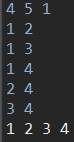

# 너비 우선 탐색(BFS)

그래프 탐색의 방법 중 하나이다. 갈 수 있는 방향을 한꺼번에 탐색한다. (최단 거리)

BFS는 주로 Queue를 사용하여 구현한다.

## 코드

```java
import java.io.BufferedReader;
import java.io.IOException;
import java.io.InputStreamReader;
import java.util.LinkedList;
import java.util.Queue;
import java.util.StringTokenizer;

public class BFSExample {
	static int N, M, V;
	static boolean[][] graph;
	static boolean[] visited;
	public static void main(String[] args) throws IOException {
		BufferedReader br = new BufferedReader(new InputStreamReader(System.in));
		StringTokenizer st = new StringTokenizer(br.readLine());
		N = Integer.parseInt(st.nextToken());
		M = Integer.parseInt(st.nextToken());
		V = Integer.parseInt(st.nextToken());
		graph = new boolean[N+1][N+1];
		visited = new boolean[N+1];

		for (int m = 0; m < M; m++) {
			st = new StringTokenizer(br.readLine());
			int n1 = Integer.parseInt(st.nextToken());
			int n2 = Integer.parseInt(st.nextToken());
			graph[n1][n2] = true;
			graph[n2][n1] = true;
		}
		
		bfs();
	}

	public static void bfs() {
		Queue<Integer> queue = new LinkedList<>();
		queue.add(V);
		visited[V] = true;
		while(!queue.isEmpty()) {
			int now = queue.poll();
			System.out.print(now + " ");
			
			for (int i = 1; i <= N; i++) {
				if(!visited[i] && graph[now][i]) {
					queue.add(i);
					visited[i] = true;
				}
			}
		}
	}
}
```

해당 코드는 백준 1260문제 [DFS와 BFS](https://www.acmicpc.net/problem/1260)를 참고하여 작성했다. (인접 행렬)

정점의 개수 N, 간선의 개수 M(양방향), 탐색을 시작할 정점의 번호 V가 주어지고, 다음 M개의 줄에는 간선이 연결하는 두 정점의 번호가 주어졌을 때, V부터 방문하는 지점을 출력하는 문제이다.

## 실행 결과

```
4 5 1
1 2
1 3
1 4
2 4
3 4
```

입력 시 출력되는 결과이다.



