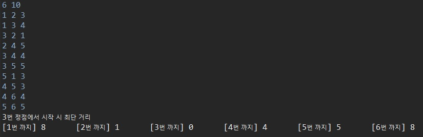

# 다익스트라(Dijkstra)

그래프에서 정점끼리 최단 경로를 구하는 알고리즘이다. 다익스트라는 한 정점을 기준을 정하고 그 정점으로부터 모든 정점을 최단 경로로 방문한다.

여기서 최단 경로란, 가중치가 가장 낮은 간선을 이용한다는 것을 의미한다. 예를 들어 BFS는 다른 정점으로 이동할 경우에는 같은 가중치를 가지고 있다. 그렇기 때문에 BFS는 가중치를 생각하지 않고 최단거리를 구할 수 있다.

따라서, 알고리즘 문제에서 이동할 때 값(cost)이 존재하고, 최소 비용이라는 말이 있다면 다익스트라 알고리즘을 생각해볼 수 있다.

## 코드

```java
import java.io.BufferedReader;
import java.io.IOException;
import java.io.InputStreamReader;
import java.util.PriorityQueue;
import java.util.StringTokenizer;

public class DijkstraExample {
	static int N, E;
	static int[][] map;
	static int[] distance;
	static boolean[] visit;
	public static void main(String[] args) throws IOException {
		BufferedReader br = new BufferedReader(new InputStreamReader(System.in));
		StringTokenizer st = new StringTokenizer(br.readLine());
		
		N = Integer.parseInt(st.nextToken());
		E = Integer.parseInt(st.nextToken());
		
		map = new int[N+1][N+1];
		distance = new int[N+1];
		visit = new boolean[N+1];
		
		for (int i = 0; i < E; i++) {
			st = new StringTokenizer(br.readLine());
			int u = Integer.parseInt(st.nextToken());
			int v = Integer.parseInt(st.nextToken());
			int weight = Integer.parseInt(st.nextToken());
			map[u][v] = weight; // 간선 출발, 간선 끝, 그 때의 간선 가중치
		}
		
		dijkstra(3); // 시작 정점 지정
		
		System.out.println("3번 정점에서 시작했을 때 최단 거리");
		for (int i = 1; i < distance.length; i++) {
			System.out.printf("[" + i + "]" + "%2d\t", distance[i]);
		}
	}

	public static void dijkstra(int start) {
		for (int i = 1; i <= N; i++) {
			distance[i] = Integer.MAX_VALUE;
		}
		distance[start] = 0;
		PriorityQueue<Node> pq = new PriorityQueue<>();
		pq.add(new Node(start, 0));
		
		while(!pq.isEmpty()) {
			Node now = pq.poll();
			visit[now.v] = true;
			
			for (int i = 1; i <= N; i++) {
				if(!visit[i] && map[now.v][i] > 0 && distance[i] > distance[now.v] + map[now.v][i]) {
					 distance[i] = distance[now.v] + map[now.v][i];
					 pq.add(new Node(i, distance[i]));
				}
			}
		}
	}
	
	public static class Node implements Comparable<Node>{
		int v, weight; // 간선의 가중치와 도착 정점

		public Node(int v, int weight) {
			this.v = v;
			this.weight = weight;
		}

		@Override
		public int compareTo(Node o) {
			return this.weight - o.weight; 
		}
	}
}
```

1. u -> v로 이동했을 때, 가중치가 얼마인지 입력받는다.
2. 시작에 앞서, 일단 모든 거리가 제일 멀다는 가정하여 distance 배열의 모든 값을 Integer.MAX_VALUE값으로 초기화 해준다.
3. 가장 가중치가 낮은 값이 먼저 뽑혀야 하기 때문에, PriorityQueue를 사용한다. PriorityQueue에서 클래스를 담는다.(현재 정점, 가중치) 클래스를 담으면 어떤 기준으로 정렬해야 할지 모르기 때문에 Comparable을 implements하여 compareTo를 재정의해야 한다.
4. 다음으로 가는 곳을 distance의 값과 비교하여 더 낮은 값이면, distance의 값을 갱신해주고 PriorityQueue에 넣는다.

## 실행 결과

```
6 10
1 2 3
1 3 4
3 2 1
2 4 5
3 4 4
3 5 5
5 1 3
4 5 3
4 6 4
5 6 5
```

N(정점의 개수), E(간선의 개수)를 먼저 입력받고, E줄에 거쳐 u에서 v로 가는 weight를 입력받는다.

입력 시 출력되는 결과이다.



