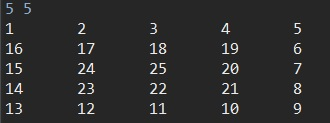

# 달팽이 배열

"n m" 형태로 입력을 받아들여 n x m 달팽이 배열을 만든다.

make() 메소드는 시계 방향, makeReverse() 메소드는 반시계 방향으로 생성한다.

## 코드

```java
import java.io.BufferedReader;
import java.io.IOException;
import java.io.InputStreamReader;
import java.util.StringTokenizer;

public class SnailExample {
	static int n, m;
	static int[][] arr;
	public static void main(String[] args) throws IOException {
		BufferedReader br = new BufferedReader(new InputStreamReader(System.in));
		StringTokenizer st = new StringTokenizer(br.readLine());
		n = Integer.parseInt(st.nextToken());
		m = Integer.parseInt(st.nextToken());
		arr = new int[n][m];
		
		make();
//		makeReverse();
		print();
	}

	public static void make() {
		
		int r = 0, c = -1, d = 1, count = 1; 
		int nCount = n, mCount = m;

		while (nCount != 0 && mCount != 0) {
			for (int i = 0; i < mCount; i++) {
				c = c + d;
				arr[r][c] = count++;
			}
			
			nCount--;
			mCount--;

			for (int i = 0; i < nCount; i++) {
				r = r + d;
				arr[r][c] = count++;
			}
			d *= -1;
		}
	}
	
	public static void makeReverse() {
			
		int r = -1, c = 0, d = 1, count = 1; 
		int ncount = n, mcount = m;

		while (ncount != 0 && mcount != 0) {
			for (int i = 0; i < ncount; i++) {
				r = r + d;
				arr[r][c] = count++;
			}
			
			ncount--;
			mcount--;
			
			for (int i = 0; i < mcount; i++) {
				c = c + d;
				arr[r][c] = count++;
			}
			d *= -1;
		}
	}
	
	public static void print() {
		for (int i = 0; i < n; i++) {
			for (int j = 0; j < m; j++) {
				System.out.printf("%d\t", arr[i][j]);
			}
			System.out.println();
		}
	}
	
}
```

## 실행 결과

- ### make() 메소드



- ### makeReverse() 메소드


