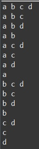
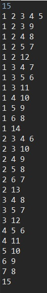

# 부분 집합

원소들로 만들 수 있는 모든 경우의 수(부분 집합)

## 1. 문자 출력

arr의 배열안의 원소들로 만들 수 있는 모든 경우의 수를 출력한다.

### 코드

```java
public class PowerSetExample {
	static char[] arr = {'a', 'b', 'c', 'd'};
	static boolean[] used = new boolean[arr.length];
	public static void main(String[] args) {
		
		makePowerSet(0);
	}
	
	public static void makePowerSet(int idx) {
		if(idx == arr.length) {
			for (int i = 0; i < arr.length; i++) {
				if(used[i]) {
					System.out.print(arr[i] + " ");
				}
			}
			System.out.println();
			return;
		}
		
		used[idx] = true;
		makePowerSet(idx+1);
		used[idx] = false;
		makePowerSet(idx+1);
	}

}
```

### 실행 결과



## 2. 숫자 출력

arr의 원소들의 합으로 입력받은 숫자(point)만큼 만들 수 있는 경우의 수를 출력한다.

### 코드

```java
import java.io.BufferedReader;
import java.io.IOException;
import java.io.InputStreamReader;

public class PowerSetExample2 {
	static int point;
	static int[] arr = { 1, 2, 3, 4, 5, 6, 7, 8, 9, 10, 11, 12, 13, 14, 15 };
	static boolean[] checked = new boolean[arr.length];
	public static void main(String[] args) throws IOException {
		BufferedReader br = new BufferedReader(new InputStreamReader(System.in));
		point = Integer.parseInt(br.readLine());
		
		makePowerSet(0, 0);
	}

	public static void makePowerSet(int idx, int sum) {
		if (idx == arr.length) {
			if (sum == point) {
				for (int i = 0; i < arr.length; i++) {
					if (checked[i]) {
						System.out.print(arr[i] + " ");
					}
				}
				System.out.println();
			}
			return;
		}

		if (sum == point) {
			for (int i = 0; i < arr.length; i++) {
				if (checked[i]) {
					System.out.print(arr[i] + " ");
				}
			}
			System.out.println();
			return;
		} else if (sum > point) {
			return;
		}

		checked[idx] = true;
		makePowerSet(idx+1, sum+arr[idx]);
		checked[idx] = false;
		makePowerSet(idx+1, sum);

	}
}
```

#### 실행 결과



