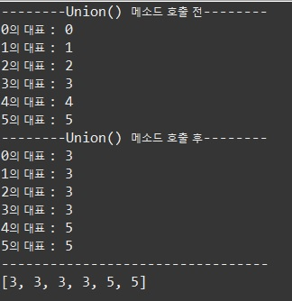

# 서로소 집합(Disjoint-set)

다수의 노드들 중에 연결된 노드를 찾거나 노드들을 합칠때 사용하는 알고리즘이며, 최소 신장 트리(MST)의 Kruskal 알고리즘에도 사용된다. 

서로소 집합은 Union Find라고도 부른다.

각자의 인덱스에 맞는 번호를 가지고 있다가(본인 노드 번호) 부모 노드의 인덱스로 바꿔준다. 그렇게 되면, 자식 노드가 속한 부모 노드가 어떤 것인지 알 수 있고, 몇 개의 집합으로 나눠져 있는지 확인할 수 있다.

## 코드

```java
import java.util.Arrays;

public class DisjointSetExample {
	static int[] arr = new int[6];
	public static void main(String[] args) {
		
		for (int i = 0; i < arr.length; i++) { // 초기화(각자의 번호)
			arr[i] = i;
		}
		
		System.out.println("--------union() 메소드 호출 전--------");
		System.out.println("0의 대표 : " + find(0));
		System.out.println("1의 대표 : " + find(1));
		System.out.println("2의 대표 : " + find(2));
		System.out.println("3의 대표 : " + find(3));
		System.out.println("4의 대표 : " + find(4));
		System.out.println("5의 대표 : " + find(5));
		union(0, 1);
		union(0, 2);
		union(0, 3);
		union(4, 5);
		System.out.println("--------union() 메소드 호출 후--------");
		System.out.println("0의 대표 : " + find(0));
		System.out.println("1의 대표 : " + find(1));
		System.out.println("2의 대표 : " + find(2));
		System.out.println("3의 대표 : " + find(3));
		System.out.println("4의 대표 : " + find(4));
		System.out.println("5의 대표 : " + find(5));
		System.out.println("---------------------------------");
		System.out.println(Arrays.toString(arr));
	}

	public static int find(int n) { // n이 속한 집합의 대표를 반환
		if(n == arr[n]) {
			return n;
		} else {
			int p = find(arr[n]);
			arr[n] = p;
			return p;
		}
	}
	
	public static void union(int n1, int n2) { // n1이 속한 집합과 n2가 속한 집합을 합침
		int p1 = find(n1);
		int p2 = find(n2);
		
		if(p1 <= p2) {
			arr[p1] = p2;
		} else {
			arr[p2] = p1;
		}
	}
}

```

find() 메소드에서 재귀 함수를 호출하는데, 

```java
arr[n] = p; 
```

위 한줄을 빼면 시간이 오래걸릴 수 있다. 그 이유는 한 번 대표를 찾았던 것을 또 다시 찾기 위해서 재귀 함수를 호출할 수 있기 때문이다. 따라서, 메모이제이션 같은 이유로 한 번 찾았던 대표를 갱신해주는 역할을 해주는 것이 좋다.

## 실행 결과



