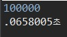

# 소수

소수는 1과 자기 자신으로밖에 나누어 떨어지지 않는 1 이외의 정수를 뜻한다. 가장 작은 수 짝수 소수는 2이면 2를 제외한 소수는 모두 홀수이다. 소수를 구하는 문제는 크게 두 가지로 나눌 수 있다.

- #### 소수 판별

- #### N까지의 소수 개수 구하기

## 1. 소수 판별

소수 판별은 다음과 같이 구할 수 있다.

"N" 형식으로 정수를 입력을 받아, N이 소수인지 판별한다. 시간 복잡도는 O(N)이다.

```java
import java.io.BufferedReader;
import java.io.IOException;
import java.io.InputStreamReader;

public class PrimeExample {

	public static void main(String[] args) throws IOException {
		BufferedReader br = new BufferedReader(new InputStreamReader(System.in));
		int N = Integer.parseInt(br.readLine());
		
		System.out.println(isPrime(N));
	}

	public static boolean isPrime(int n) {
		for (int i = 2; i < n; i++) {
			if (n % i == 0)
				return false;
		}
		return true;
	}
}
```

## 실행 결과


## 2. N까지의 소수 개수 구하기

- ### 직관적으로 구하는 방법(Naive)

  직관적으로 2중 포문을 구현하여 소수를 구할 수 있다. 소수의 정의를 생각하며 구현하면 쉽게 구할 수 있다. 하지만 시간 복잡도가 O(N^2)이기 때문에 느리다.

  "N" 형식으로 정수를 입력을 받아, N까지의 소수의 개수를 출력한다.

  ### 코드

  ```java
  import java.io.BufferedReader;
  import java.io.IOException;
  import java.io.InputStreamReader;
  
  public class PrimeExample2 {
  	public static void main(String[] args) throws IOException {
  		BufferedReader br = new BufferedReader(new InputStreamReader(System.in));
  		int N = Integer.parseInt(br.readLine());
  		
  		int i, j, cnt = 0;
  		for (i = 2; i <= N; i++) {
  			for (j = 2; j < i; j++) {
  				if(i % j == 0) {
  					break;
  				}
  			}
  			if(i == j) {
  				System.out.print(i + " ");
  				cnt++;
  			}
  		}
  		System.out.println();
  		System.out.println(N + "까지의 소수의 개수 : " + cnt);
  	}
  }
  ```

  ### 실행 결과

  

  

- ### 에라토스테네스의 체

  소수의 배수를 전부 걸러내고 N까지의 모든 소수를 판별할 수 있다. 2가 소수라면 2의 배수는 소수가 아니기 때문에 모두 건너 뛸 수 있다. 3이 소수라면 3의 배수는 소수가 아니기 때문에 마찬가지로 모두 건너 뛸 수 있다. 이와 같은 방식으로 진행된다.

  "N" 형식으로 정수를 입력을 받아, N까지의 소수의 개수를 출력한다. 시간 복잡도는O(nlog(logn))이지만 실제로 알고리즘 문제에서 사용할 경우 O(N)과 동일한 효율성을 가진다.

  ```java
  import java.io.BufferedReader;
  import java.io.IOException;
  import java.io.InputStreamReader;
  import java.util.Arrays;
  
  public class PrimeExample3 {
  	static int N;
  	static boolean[] noPrime;
  	public static void main(String[] args) throws IOException {
  		BufferedReader br = new BufferedReader(new InputStreamReader(System.in));
  		N = Integer.parseInt(br.readLine());
  		noPrime = new boolean[N+1];
  		noPrime[0] = noPrime[1] = true;
  		
  		isPrime();
  		int cnt = 0;
  		for (int i = 0; i <= N; i++) {
  			if(!noPrime[i]) {
  				System.out.print(i + " ");
  				cnt++;
  			}
  		}
  		
  		System.out.println();
  		System.out.println(N + "까지의 소수의 개수 : " + cnt);
  	}
  	
  	public static void isPrime() {
      	for (int i = 2; i*i <= N; i++) {
  			if(!noPrime[i]) {
  				for (int j = i*i; j <= N; j+=i) {
  					noPrime[j] = true;
  				}
  			}
  		}
      }
  }
  ```

  ### 실행 결과

  

  결과는 동일하다.

- ### 속도 비교

  시간 측정에서 System.nanoTime() 메소드를 사용하였으며, 입력 받은 직후를 시작 시점으로 정하여 측정했고, 모든 로직이 종료되었을 때를 끝나는 시점으로 했다. 입력 값은 "100000"으로 실험했다.

  - #### 직관적으로 구한 경우 

    

  - #### 에라토스테네스의 체

    

  차이가 크다는 것을 확인할 수 있다.