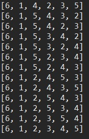

# 순열

원소들로 만들 수 있는 모든 경우의 수(순열). 순열은 순서가 결과에 영향이 있다.

## 1. 배열안의 숫자를 전부 사용

arr의 배열안의 원소들로 만들 수 있는 순열을 모두 출력한다.

swap() 메소드로 **배열의 정보를 변경**하면서 결과를 만든다.

### 코드

```java
package data_structure;

import java.util.Arrays;

public class PermutationExample {
	static int[] arr = { 1, 2, 3, 4, 5, 6 };

	public static void main(String[] args) {
		perm(0);
	}

	public static void perm(int k) {
		if (k == arr.length) {
			System.out.println(Arrays.toString(arr));
			return;
		}

		for (int i = k; i < arr.length; i++) {
			swap(i, k);
			perm(k + 1);
			swap(i, k);
		}
	}

	public static void swap(int i, int j) {
		int temp = arr[i];
		arr[i] = arr[j];
		arr[j] = temp;
	}
}
```

### 실행 결과




## 2. 배열안의 숫자로 r개를 뽑는 경우

알고리즘 문제 풀이 시 좋아하는 방식이다.(LinkedList 사용)

arr의 배열안의 원소들로 r개를 선택하여 만들 수 있는 순열을 모두 출력한다.

### 코드

```java
package data_structure;

import java.util.LinkedList;

public class PermutationExample2 {
	static int[] arr = { 1, 2, 3, 4, 5, 6 };
	static boolean[] used = new boolean[arr.length];
	static LinkedList<Integer> result = new LinkedList<>();

	public static void main(String[] args) {

		perm(0, 3);
	}

	static void perm(int cnt, int r) {
		if (cnt == r) {
			System.out.println(result);
			return;
		}

		for (int i = 0; i < arr.length; i++) {
			if (!used[i]) {
				result.add(arr[i]);
				used[i] = true;
				perm(cnt + 1, r);
				used[i] = false;
				result.removeLast();
			}
		}
	}
}
```

#### 실행 결과


