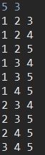

# 조합

원소들로 만들 수 있는 중복되지 않은 숫자들의 모든 경우의 수. 조합은 순열과 달리 순서가 중요하지 않고 중복이 되지 않아야 한다.

## 1. 배열 두 개 사용

"n r" 형태로 입력을 받아들여 **n개 중에 r개를 사용하여 만들 수 있는 조합**을 모두 출력한다.

arr 배열에 값을 저장해 놓고, combi() 메소드에서 arr2 배열에 인덱스를 저장한다. 재귀 함수 종료 시 arr2 배열의 인덱스에 맞는 값을 출력한다.

### 코드

```java
import java.io.BufferedReader;
import java.io.IOException;
import java.io.InputStreamReader;
import java.util.StringTokenizer;

public class CombinationExample {
	static int[] arr;
	static int[] arr2;
	public static void main(String[] args) throws IOException {
		BufferedReader br = new BufferedReader(new InputStreamReader(System.in));
		StringTokenizer st = new StringTokenizer(br.readLine());
		int n = Integer.parseInt(st.nextToken());
		int r = Integer.parseInt(st.nextToken());
		arr = new int[n];
		arr2 = new int[n];
		
		for (int i = 0; i < arr.length; i++) {
			arr[i] = i+1;
		}
		
		combi(n, r, 0, 0);
	}
	
	public static void combi(int n, int r, int index, int target) {
		if(r == 0) {
			for (int i = 0; i < index; i++) {
				System.out.print(arr[arr2[i]] + " ");
			}
			System.out.println();
			return;
		}
		if(target == n) {
			return;
		}
		
		arr2[index] = target;
		combi(n, r-1, index+1, target+1); // 뽑는 경우
		combi(n, r, index, target+1); // 뽑지 않는 경우
	}

}
```

### 실행 결과



## 2. 값을 하나씩 증가시키는 경우

알고리즘 문제 풀이 시 좋아하는 방식이다.(LinkedList 사용)

"n r" 형태로 입력을 받아들여 **n개 중에 r개를 사용하여 만들 수 있는 조합**을 모두 출력한다.

### 코드

```java
import java.io.BufferedReader;
import java.io.IOException;
import java.io.InputStreamReader;
import java.util.LinkedList;
import java.util.StringTokenizer;

public class CombinationExample2 {
	static LinkedList<Integer> list = new LinkedList<>();
	static boolean[] used;
	public static void main(String[] args) throws IOException {
		BufferedReader br = new BufferedReader(new InputStreamReader(System.in));
		StringTokenizer st = new StringTokenizer(br.readLine());
		int n = Integer.parseInt(st.nextToken());
		int r = Integer.parseInt(st.nextToken());
		used = new boolean[n];
		
		combi(n, r, 0);
	}

	public static void combi(int n, int r, int target) {
		if(r == 0) {
			for (int i = 0; i < list.size(); i++) {
				System.out.print(list.get(i) + " ");
			}
			System.out.println();
			return;
		}
		else if(n == target) {
			return;
		}
		
		list.add(target+1);
		combi(n, r-1, target+1);
		list.removeLast();
		combi(n, r, target+1);
	}
}
```

#### 실행 결과


결과가 동일하다.