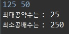

# 최대공약수와 최소공배수

먼저 공약수란, 두 수 혹은 그 이상의 여러 수의 **공통인 약수**라는 뜻이다. 그러므로, 최대공약수는 공약수 중 가장 큰 것을 의미한다.

최대공약수를 구할 때, 유클리드 호제법을 이용한다. 유클리드 호제법이란 쉽게 말하면 나머지가 0이 되도록 나누는 것이다. 

> 1. 입력으로 두 수 n, m(n>m)이 들어온다.
> 2. n이 m으로 나누어 떨어지면, m을 출력하고 알고리즘을 종료한다.
> 3. 그렇지 않으면, n을 m으로 나눈 나머지를 새롭게 m에 대입하고, n을 m으로 바꾸고 2번으로 돌아온다.

 위와 같은 로직을 반복문이나 재귀를 통하여 구할 수 있다.

## 1. 최대공약수

"N M" 형식으로 두 정수를 입력을 받아, 최대공약수를 구한다.

```java
import java.io.BufferedReader;
import java.io.IOException;
import java.io.InputStreamReader;
import java.util.StringTokenizer;

public class GCDExample {
	public static void main(String[] args) throws IOException {
		BufferedReader br = new BufferedReader(new InputStreamReader(System.in));
		StringTokenizer st = new StringTokenizer(br.readLine());
		int N = Integer.parseInt(st.nextToken());
		int M = Integer.parseInt(st.nextToken());

		int gcd = calcGCD(N, M);

		System.out.println("최대공약수는 : " + gcd);
	}

	public static int calcGCD(int n, int m) {
		if (n % m == 0)
			return m;
		return calcGCD(m, n % m);
	}
}
```

## 2. 최소공배수

최소공배수는 위에서 구한 최대공약수를 사용하여 쉽게 구할 수 있다. 두 수의 곱을 최대공약수로 나누면 최소공배수가 되기 때문이다.

```java
int gcd = (N * M) / gcd;
```

### 코드

```java
import java.io.BufferedReader;
import java.io.IOException;
import java.io.InputStreamReader;
import java.util.StringTokenizer;

public class GCDAndLCMExample {
	public static void main(String[] args) throws IOException {
		BufferedReader br = new BufferedReader(new InputStreamReader(System.in));
		StringTokenizer st = new StringTokenizer(br.readLine());
		int N = Integer.parseInt(st.nextToken());
		int M = Integer.parseInt(st.nextToken());

		int gcd = calcGCD(N, M);
		int lcm = (N * M) / gcd;

		System.out.println("최대공약수는 : " + gcd);
		System.out.println("최소공배수는 : " + lcm);
	}

	public static int calcGCD(int n, int m) {
		if (n % m == 0)
			return m;
		return calcGCD(m, n % m);
	}
}
```

### 실행 결과


