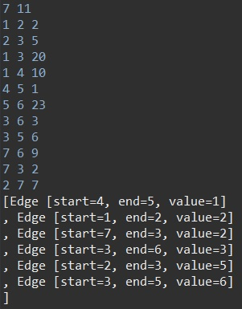

# 최소 신장 트리(MST) - Kruskal

신장 트리란 사이클(u1 -> u2, u2 -> u1)이 형성하지 않는 그래프를 뜻한다. 최소 신장 트리는 가장 적은 비용으로 모든 노드를 연결시키는 알고리즘이다. 대표적으로 Kruskal, Prim 알고리즘이 있다.

Kruskal 알고리즘은 시작은 정해져 있지 않고, 가장 적은 비용을 가진 간선을 찾아 노드를 잇는 방식이다. (간선 중심) 어떻게 노드와 연결되었는지 알 수 있을까? 바로 서로소 집합(Disjoint-set)을 사용한다.

## 코드

```java
import java.io.BufferedReader;
import java.io.IOException;
import java.io.InputStreamReader;
import java.util.ArrayList;
import java.util.PriorityQueue;
import java.util.StringTokenizer;

public class KruskalExample {
	static int V, E; // 정점(V), 간선(E)
	static ArrayList<Edge> mst; // 선택한 간선들만 넣어서 만드는 최소 신장 트리 결과물
	static int[] arr; // disjoint-set 확인을 위한 배열
	static PriorityQueue<Edge> pq; // kruskal에서는 모든 간선을 여기에 집어넣고 시작
	public static void main(String[] args) throws IOException {
		BufferedReader br = new BufferedReader(new InputStreamReader(System.in));
		StringTokenizer st = new StringTokenizer(br.readLine());
		V = Integer.parseInt(st.nextToken()); // 정점 갯수
		E = Integer.parseInt(st.nextToken()); // 간선 갯수
		
		pq = new PriorityQueue<>();
		mst = new ArrayList<>();
		arr = new int[V+1];
		
		for (int i = 1; i <= V; i++) {
			arr[i] = i;
		}
		
		for (int i = 0; i < E; i++) {
			st = new StringTokenizer(br.readLine());
			int v1 = Integer.parseInt(st.nextToken());
			int v2 = Integer.parseInt(st.nextToken());
			int value = Integer.parseInt(st.nextToken());
			
			pq.add(new Edge(v1, v2, value));
		}
		
		while(mst.size() < (V-1)) { // V개의 정점을 연결하기 위한 최소 간선 갯수는 V-1개
			Edge edge = pq.poll();
			
			if(find(edge.start) != find(edge.end)) {
				mst.add(edge);
				union(edge.start, edge.end);
			}
		}
		
		System.out.println(mst);
	}
	
	public static int find(int n) {
		if(n == arr[n]) {
			return n;
		} else {
			int p = find(arr[n]);
			arr[n] = p;
			return p;
		}
	}
	
	public static void union(int n1, int n2) {
		int p1 = find(n1);
		int p2 = find(n2);
		
		if(p1 <= p2) {
			arr[p1] = p2;
		} else {
			arr[p2] = p1;
		}
	}
	
	public static class Edge implements Comparable<Edge>{
		int start, end, value;
		
		public Edge(int start, int end, int value) {
			this.start = start;
			this.end = end;
			this.value = value;
		}

		@Override
		public int compareTo(Edge o) {
			return this.value - o.value;
		}

		@Override
		public String toString() {
			return "Edge [start=" + start + ", end=" + end + ", value=" + value + "]\n";
		}
	}
}
```

1. 적은 비용을 먼저 사용해야 하기 때문에, PriorityQueue를 사용하고, 시작점과 끝, 비용을 한꺼번에 저장하고 있어야 하기 때문에 Edge라는 클래스를 사용한다. 
2. 현재 노드의 시작과 끝을 find() 메소드로 찾아서, 같지 않다면 연결되어 있지 않다는 것이므로 결과물인 mst에 넣는다. 종료 조건은 mst가 모두 연결되는 조건. 즉, 노드의 개수(V) -1이다.

## 실행 결과

```
7 11
1 2 2
2 3 5
1 3 20
1 4 10
4 5 1
5 6 23
3 6 3
3 5 6
7 6 9
7 3 2
2 7 7
```

V(정점의 개수), E(간선의 개수)를 먼저 입력받고, E줄에 거쳐 u에서 v로 가는 weight를 입력받는다.

입력 시 출력되는 결과이다.



