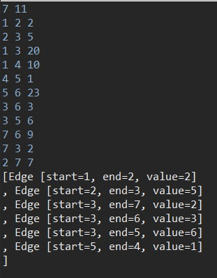

# 최소 신장 트리(MST) - Prim

신장 트리란 사이클(u1 -> u2, u2 -> u1)이 형성하지 않는 그래프를 뜻한다. 최소 신장 트리는 가장 적은 비용으로 모든 노드를 연결시키는 알고리즘이다. 대표적으로 Kruskal, Prim 알고리즘이 있다.

Prim 알고리즘은 Kruskal 알고리즘과 달리 정점 중심의 알고리즘이다. 시작점을 정하여 가장 적은 비용을 가진 간선을 선택하는 방식이다.

그러므로, 간선의 개수가 적은 경우에는 Kruskal 알고리즘을 사용하고 간선의 개수가 많은 경우에는 Prim 알고리즘을 사용하는 것이 좋다.

## 코드

```java
import java.io.BufferedReader;
import java.io.IOException;
import java.io.InputStreamReader;
import java.util.ArrayList;
import java.util.LinkedList;
import java.util.PriorityQueue;
import java.util.Queue;
import java.util.StringTokenizer;

public class PrimExample {
	static int V, E; // 정점(V), 간선(E)
	static LinkedList<Edge>[] graph; // n번 정점에서 연결된 간선 정보를 정점마다 유지하도록 하는 인접 리스트
	static ArrayList<Edge> mst; // 선택한 간선들만 넣어서 만드는 최소 신장 트리 결과물
	static boolean[] visited;
	public static void main(String[] args) throws IOException {
		BufferedReader br = new BufferedReader(new InputStreamReader(System.in));
		StringTokenizer st = new StringTokenizer(br.readLine());
		
		V = Integer.parseInt(st.nextToken());
		E = Integer.parseInt(st.nextToken());
		
		graph = new LinkedList[V+1]; // 1번부터 V번까지 사용
		visited = new boolean[V+1];
		mst = new ArrayList<>();
		
		for (int i = 1; i <= V; i++) {
			graph[i] = new LinkedList<>();
		}
		
		for (int i = 0; i < E; i++) {
			st = new StringTokenizer(br.readLine());
			int v1 = Integer.parseInt(st.nextToken());
			int v2 = Integer.parseInt(st.nextToken());
			int value = Integer.parseInt(st.nextToken());
			
			graph[v1].add(new Edge(v1, v2, value));
			graph[v2].add(new Edge(v2, v1, value));
		}
		
		prim();
		
		System.out.println(mst);
	}
	
	public static void prim() {
		PriorityQueue<Edge> pq = new PriorityQueue<>();
		Queue<Integer> queue = new LinkedList<>(); // 정점 방문 스케쥴 처리를 위한 큐
		queue.add(1);
		
		while(!queue.isEmpty()) {
			int now = queue.poll();
			visited[now] = true;
			
			for (Edge edge : graph[now]) { // 현재 정점 now에서 연결된 간선들 중
				if(!visited[edge.end]) { // 방문한 적 없는 정점으로 가는 간선들을 우선순위 큐에 추가
					pq.add(edge);
				}
			}
			
			while(!pq.isEmpty()) {
				Edge edge = pq.poll();
				if(!visited[edge.end]) {
					queue.add(edge.end);
					visited[edge.end] = true;
					mst.add(edge);
					break;
				}
			}
		}
	}
	
	public static class Edge implements Comparable<Edge>{
		int start, end, value;
		
		public Edge(int start, int end, int value){
			this.start = start;
			this.end = end;
			this.value = value;
		}

		@Override
		public int compareTo(Edge o) {
			return this.value - o.value;
		}

		@Override
		public String toString() {
			return "Edge [start=" + start + ", end=" + end + ", value=" + value + "]\n";
		}
	}
}
```

1. 시작 정점 아무거나 지정한다.
2. 선택한 정점에 연결된 간선들을 PriorityQueue에 전부 넣는다.
3. PriorityQueue에서 poll() 메소드를 호출하면 제일 짧은 간선이 나온다. 그 끝 정점이 이미 방문한 정점이 아니라면 해당 정점 선택을 함. (mst.add())
4. 모든 정점이 연결될 때 까지 2~3 를 반복한다.

## 실행 결과

```
7 11
1 2 2
2 3 5
1 3 20
1 4 10
4 5 1
5 6 23
3 6 3
3 5 6
7 6 9
7 3 2
2 7 7
```

V(정점의 개수), E(간선의 개수)를 먼저 입력받고, E줄에 거쳐 u에서 v로 가는 weight를 입력받는다.

입력 시 출력되는 결과이다.



