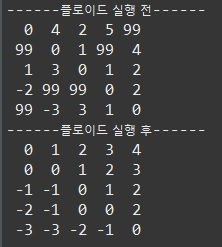

# 플로이드 워셜(Floyd-Warshall)

https://cloge.tistory.com/28

그래프에서 정점끼리 최단 경로를 구하는 알고리즘이다. 플로이드는 다익스트라와 달리 음수 가중치가 있어도 최단 경로를 구할 수 있다. 하지만, 모든 정점에 대해서 탐색해야 하기 때문에 시간 복잡도는 O(N^3)이다.

## 코드

```java
public class FloydExample {
	static final int INF = 99;
	static int N = 5;
	static int[][] map = {
			{0, 4, 2, 5, INF},
			{INF, 0, 1, INF, 4},
			{1, 3, 0, 1, 2},
			{-2, INF, INF, 0, 2},
			{INF, -3, 3, 1, 0}};
	public static void main(String[] args) {
		System.out.println("------플로이드 실행 전------");
		printMap();
		floyd();
		System.out.println("------플로이드 실행 후------");
		printMap();
	}
	
	public static void floyd() {
		for (int k = 0; k < N; k++) {
			for (int i = 0; i < N; i++) {
				for (int j = 0; j < N; j++) {
					map[i][j] = Math.min(map[i][k] + map[k][j], map[i][j]);
				}
			}
		}
	}
	
	public static void printMap() {
		for (int i = 0; i < N; i++) {
			for (int j = 0; j < N; j++) {
				System.out.printf("%3d", map[i][j]);
			}
			System.out.println();
		}
	}
}
```

1. map\[i]\[j]은 정점 i로부터 j까지의 최단거리이다.
2. floyd() 메소드의 3중 포문의 map\[i]\[j] = Math.min(map\[i]\[j] + map\[k]\[j], map\[i]\[j])가 의미하는 것은 모든 정점 k에 대해 i에서 k를 거쳐 j로 이동하는 최단거리들 중 최솟값을 의미한다. (점화식)
3. 이러한 것을 모든 정점에 대하여 수행해야 한다.

## 실행 결과



