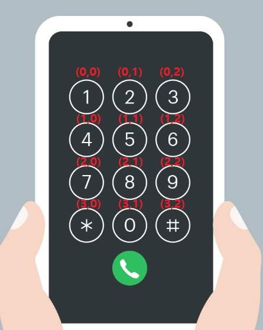

# 키패드 누르기

https://programmers.co.kr/learn/courses/30/lessons/67256

## 풀이

정수 1차원 배열 numbers와 문자열 hand가 주어진다.

1. 각각의 키패드의 숫자의 x, y 좌표를 다음과 같이 지정하고 싶었다. 그럼 왼쪽 손가락과 오른쪽 손가락의 거리를 쉽게 구할 수 있다.(맨해튼 거리) 따라서 클래스를 만들어서 해당 키패드의 정보를 담았다.

   

2. 이 정보를 담을 배열을 Phone[] 배열을 만들어서 여기에 모든 키패드의 정보를 담았다.(* = 10, 0 = 11, # = 12)

3. 키패드가 1, 4, 7이면 왼쪽이고 3, 6, 9면 오른쪽인데, 여기서 가운데 키패드를 신경써야한다. 0번의 경우 11로 했으니 0일 경우 11로 바꿔주고 접근하는 경우는 해당 키패드 -1로 접근했다.(p[numbers[i]-1])

4. 그리고, 마지막 누르는 위치를 꼭 기억해야 한다는 점이다. 누르고 나면 left와 right 변수에 새로 넣어줘야 한다. 작성하고 나니 뭔가 조잡한데.. 메소드로 따로 뺐으면 좋았을 것 같다. ~~(근데 이게 왜 Level 1짜리 문제지?ㅎ 꽤나 고민했는데..)~~

## 코드

```java
class Solution {
    public String solution(int[] numbers, String hand) {
        StringBuilder sb = new StringBuilder();
        
        int left = 10, right = 12;
        
        Phone[] p = new Phone[12];
        for (int i = 0; i < p.length; i++) {
        	p[i] = new Phone(i/3, i%3);
		}
        
        for (int i = 0; i < numbers.length; i++) {
			if(numbers[i] == 1 || numbers[i] == 4 || numbers[i] == 7) {
				sb.append("L");
				left = numbers[i];
			} else if(numbers[i] == 3 || numbers[i] == 6 || numbers[i] == 9) {
				sb.append("R");
				right = numbers[i];
			} else {
				if(numbers[i] == 0) {
					numbers[i] = 11; 
				}
				Phone next = p[numbers[i]-1];
				
				int leftDist = Math.abs(p[left-1].y - next.y) + Math.abs(p[left-1].x - next.x);
				int rightDist = Math.abs(p[right-1].y - next.y) + Math.abs(p[right-1].x - next.x);
				
				if(leftDist == rightDist) {
					if(hand.equals("left")) {
						sb.append("L");
						left = numbers[i];
					} else {
						sb.append("R");
						right = numbers[i];
					}
				} else if(leftDist < rightDist) {
					sb.append("L");
					left = numbers[i];
				} else {
					sb.append("R");
					right = numbers[i];
				}
			}
		}
        
        return sb.toString();
    }
	
	class Phone {
		int x, y;

		public Phone(int x, int y) {
			this.x = x;
			this.y = y;
		}
	}
}
```